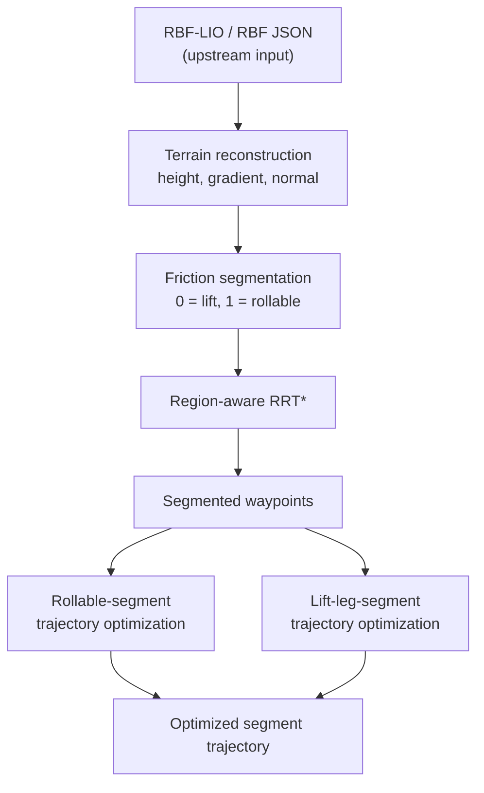

# RBF-Terrain-Based Trajectory Optimization for Wheel-Legged Robots

## Overview

This repository contains an offline planning and nonlinear trajectory-optimization system for a two-wheel / wheel-legged mechanism moving on a continuous 2.5D terrain model. It reconstructs terrain height and derivatives from radial basis functions (RBFs), classifies the terrain by friction feasibility, plans a coarse two-dimensional path with a region-aware RRT*, and refines rollable or lift-required path segments with Chebyshev-polynomial trajectories and Ipopt.

RBF-LIO is the upstream source of the terrain representation: it can export the RBF centers and weights consumed here. **This repository does not implement RBF-LIO, LiDAR/IMU state estimation, or SLAM.** Its scope starts from an RBF terrain snapshot or JSON file and covers downstream planning and optimization.

The C++/Ipopt implementations are the main development path. The root Python/CasADi files are research prototypes and do not form the same complete pipeline. The current output is an offline, geometrically sampled trajectory; it is not a time-parameterized robot command and the repository has no ROS or low-level controller interface.

## Pipeline



This is the intended data flow, but it is not yet a single automated command. The segment optimizers currently process only the first matching rollable or lift segment, and the repository does not stitch all optimized segments into a complete route.

## Features

- RBF height-field evaluation with analytic gradient and upward surface normal.
- CUDA terrain-grid evaluation and friction-aware binary labeling (`0 = lift`, `1 = rollable`).
- Region-aware RRT* whose edge cost penalizes, rather than forbids, travel through lift regions.
- Chebyshev trajectory parameterization for the base and left/right wheel paths.
- Ipopt TNLP implementations with geometric, terrain, contact-related, boundary, and smoothing terms.
- Separate refinement for rollable segments and lift-required segments.
- A standalone general full-trajectory NLP with explicit sampled contact-force variables.
- Text and PNG outputs plus Python visualization scripts for segmentation and segment trajectories.

## Repository Structure

| Path | Role |
|---|---|
| `terrain_friction_segment/` | CUDA RBF terrain segmentation and the CPU `rrt_star_region` coarse planner. |
| `trajopt_cpp/` | Standalone general C++ NLP and the shared Chebyshev, RBF, JSON-reader, and objective sources reused by the segment optimizers. |
| `seg_trajopt_cpp/` | Ipopt optimizer for the first rollable waypoint segment; wheel heights are evaluated from the terrain. |
| `lift_leg_trajopt_cpp/` | Ipopt optimizer for the first lift segment; includes piecewise wheel-height trajectories and swing/contact modeling. |
| `core/`, `constraints/`, `geometry/`, `solver/` | Modular Python prototype abstractions for variables, objectives, constraints, terrain, and solver wrapping. |
| `main.py`, `solve_casadi.py`, `trajopt_sdf.py` | Python/CasADi prototypes; not the main end-to-end implementation. |
| `test/terrain_res/` | Checked-in RBF input and coarse-planning artifacts for smoke tests; artifact provenance is not fully recorded. |
| `RBF_LIO.pdf` | Theoretical reference for the upstream RBF terrain representation. |

`seg_trajopt_cpp` and `lift_leg_trajopt_cpp` compile selected sources directly from the sibling `trajopt_cpp` directory, so these directories must retain their current relative layout.

## Core Algorithms

1. **RBF terrain:** the terrain is modeled as a single-valued height field
   `z = sum_i w_i exp(-||[x,y]-c_i||^2 / (2 sigma^2))`. The C++ JSON reader consumes `cur_rbf_grid` and `rbf_weight`; it currently hard-codes `sigma = 0.14` rather than reading it from JSON.
2. **Friction segmentation:** the CUDA kernel evaluates RBF gradients and labels a grid point rollable when its slope satisfies the friction proxy `||grad f|| <= mu`.
3. **Region-aware RRT*:** the planner searches in the terrain's `(x,y)` bounds. Both region types remain traversable, but path length through label `0` receives a larger cost.
4. **Chebyshev parameterization:** normalized path parameter `s` lies in `[0,1]`; base pose and wheel positions are represented by low-order Chebyshev coefficients.
5. **Nonlinear programming:** objectives and sampled constraints are exposed through Ipopt TNLP callbacks. The three C++ optimizers use limited-memory Hessian approximation and MUMPS.
6. **Mode-specific refinement:** `seg_trajopt_cpp` keeps wheel `z` on the RBF surface, while `lift_leg_trajopt_cpp` introduces piecewise wheel-height coefficients and swing/contact logic.

See [ALGORITHM.md](ALGORITHM.md) for equations, decision-variable layouts, objectives, constraints, pseudocode, and numerical caveats.

## Requirements

No dependency versions are locked in the repository.

| Scope | Requirements |
|---|---|
| Core C++ optimization | C++17 compiler, CMake 3.10+, Ipopt development files, MUMPS, and `pkg-config` when Ipopt is not exposed through CMake. |
| CUDA terrain segmentation and bundled RRT* target | CMake 3.18+, CUDA Toolkit, and a compatible NVIDIA GPU/driver. The current CMake project requires CUDA even if only `rrt_star_region` is needed. |
| Visualization | Python 3, NumPy, and Matplotlib. |
| Python NLP prototypes only | CasADi in addition to NumPy and Matplotlib. |
| Optional performance test only | CuPy with a package variant compatible with the installed CUDA Toolkit. |

On Ubuntu, `coinor-libipopt-dev` is the Ipopt package named by the current CMake files. A typical dependency setup is documented in [DEPLOYMENT.md](DEPLOYMENT.md); it is intentionally not duplicated here because CUDA installation depends on the host GPU and Ubuntu release.

## Build

Run from the repository root. Use fresh, independent build directories rather than the historical `build*` directories checked into the working tree.

```bash
cmake -S trajopt_cpp -B _build/trajopt_cpp -DCMAKE_BUILD_TYPE=Release
cmake --build _build/trajopt_cpp --parallel

cmake -S terrain_friction_segment -B _build/terrain_friction_segment \
  -DCMAKE_BUILD_TYPE=Release
cmake --build _build/terrain_friction_segment --parallel

cmake -S seg_trajopt_cpp -B _build/seg_trajopt_cpp -DCMAKE_BUILD_TYPE=Release
cmake --build _build/seg_trajopt_cpp --parallel

cmake -S lift_leg_trajopt_cpp -B _build/lift_leg_trajopt_cpp \
  -DCMAKE_BUILD_TYPE=Release
cmake --build _build/lift_leg_trajopt_cpp --parallel
```

The CUDA project defaults to architectures `70;80;86`. Override this when the target GPU requires a different compute capability:

```bash
cmake -S terrain_friction_segment -B _build/terrain_friction_segment \
  -DCMAKE_BUILD_TYPE=Release \
  -DCMAKE_CUDA_ARCHITECTURES=<target_arch>
```

Expected executables are:

```text
_build/trajopt_cpp/trajopt_cpp
_build/terrain_friction_segment/terrain_friction_segment
_build/terrain_friction_segment/rrt_star_region
_build/seg_trajopt_cpp/seg_trajopt_cpp
_build/lift_leg_trajopt_cpp/lift_leg_trajopt_cpp
```

## Quick Start

The following smoke workflow uses `test/terrain_res/rbf.json`, rebuilds the terrain segmentation in a new `/tmp` directory, and reuses the checked-in labeled waypoints to run the first rollable and first lift optimization. It does not overwrite existing repository artifacts.

```bash
RUN=/tmp/trajopt_quickstart
mkdir -p "$RUN/data" "$RUN/roll" "$RUN/lift"

# 1. Reconstruct and segment the RBF terrain; mu = 0.3.
MPLBACKEND=Agg \
./_build/terrain_friction_segment/terrain_friction_segment \
  test/terrain_res/rbf.json "$RUN/data" 0.3

# 2. Supply the checked-in labeled coarse path.
# Its provenance is not fully recorded, so this is a smoke input, not a benchmark result.
cp test/terrain_res/waypoints_segmented.txt "$RUN/data/waypoints_segmented.txt"

# 3. Optimize the first rollable segment and the first lift segment.
./_build/seg_trajopt_cpp/seg_trajopt_cpp "$RUN/data" "$RUN/roll"
./_build/lift_leg_trajopt_cpp/lift_leg_trajopt_cpp "$RUN/data" "$RUN/lift"

# 4. Render results without opening GUI windows.
python3 seg_trajopt_cpp/scripts/plot_seg_trajectory.py "$RUN/roll" --no-show
python3 lift_leg_trajopt_cpp/scripts/plot_seg_trajectory.py \
  "$RUN/lift" --rbf "$RUN/data/rbf.json" --no-show
```

Inspect the Ipopt return status in stdout or a captured log. The presence of `final_trajectory.txt` alone does not prove successful convergence.

### Regenerating the coarse path

The actual RRT* CLI is:

```bash
./_build/terrain_friction_segment/rrt_star_region \
  <terrain_segmentation_data.txt> \
  <start_x> <start_y> <goal_x> <goal_y> <rrt_star_path.txt>
```

For the checked-in example, the configured start and goal used by the project documentation are `0.6 1.2` and `2.4 -3.0`. However, the current executable only redirects the path text file: `waypoints_segmented.txt` and `rrt_star_path.png` are still written to the hard-coded directory `/home/yizhe/trajopt/test/terrain_res`, and the program attempts to open the PNG. Therefore RRT* regeneration is deliberately excluded from the portable smoke workflow above. See [DEPLOYMENT.md](DEPLOYMENT.md) for the exact current deployment constraint and [EXPERIMENT.md](EXPERIMENT.md) for an isolated experiment protocol.

The standalone general optimizer can be run separately:

```bash
./_build/trajopt_cpp/trajopt_cpp test/terrain_res/rbf.json
```

It uses source-defined start/goal states and does not consume `waypoints_segmented.txt`; it is not the final assembly stage of the segmented pipeline.

## Output

| File | Meaning |
|---|---|
| `rbf.json` | Copy of the segmentation input placed in its output directory. |
| `segmentation.txt` | Grid metadata followed by binary region labels. |
| `segmentation.png` | Green rollable / red lift segmentation image. |
| `segmentation_comparison.png` | Terrain and segmentation comparison image. |
| `terrain_segmentation_data.txt` | Grid metadata, reconstructed heights, then labels; consumed by RRT* and the roll optimizer. |
| `rrt_star_path.txt` | Coarse path, one `x y` point per line. |
| `waypoints_segmented.txt` | Coarse path with one `x y label` point per line; `0 = lift`, `1 = rollable`. |
| `rrt_star_path.png` | Coarse path over the region map. |
| `initial_trajectory.txt` | Segment initial guess with columns `s xb yb zb psi xl yl zl xr yr zr`. |
| `final_trajectory.txt` | Final Ipopt iterate with the same columns; `s` is a normalized path parameter, not time. |
| `terrain_grid.txt` | `seg_trajopt_cpp` terrain grid used by its plotting script. |

In the Quick Start above, segmentation outputs are under `$RUN/data`, roll outputs under `$RUN/roll`, and lift outputs under `$RUN/lift`. The segment plotting scripts add `seg_trajectory_plot.png` and `seg_trajectory_kinematics.png` to their respective output directories.

The standalone `trajopt_cpp` uses temporary files under `/tmp` for visualization rather than the segment output contract. See [ARCHITECTURE.md](ARCHITECTURE.md) for the full data contracts.

## Visualization

```bash
# Rollable-segment trajectory
python3 seg_trajopt_cpp/scripts/plot_seg_trajectory.py <roll_output_dir> --no-show

# Lift-segment trajectory with the RBF surface
python3 lift_leg_trajopt_cpp/scripts/plot_seg_trajectory.py \
  <lift_output_dir> --rbf <rbf.json> --no-show

# Terrain segmentation; this script supports timed auto-close, not --no-show.
MPLBACKEND=Agg python3 \
  terrain_friction_segment/scripts/visualize_terrain_segmentation.py \
  <terrain_segmentation_data.txt> --auto-close 1
```

Use `MPLBACKEND=Agg` and the available `--no-show` flags on SSH or other headless systems. The segmentation executable itself still attempts to launch its visualization script, and `rrt_star_region` attempts to open its PNG.

## Documentation

| Document | Purpose |
|---|---|
| [AGENTS.md](AGENTS.md) | Repository rules, build/run facts, invariants, and constraints for AI coding agents and contributors. Read before changing code. |
| [ARCHITECTURE.md](ARCHITECTURE.md) | Module boundaries, dependency graph, data flow, data contracts, and recommended code-reading order. |
| [ALGORITHM.md](ALGORITHM.md) | Mathematical models, decision variables, objectives, constraints, pseudocode, and numerical considerations. |
| [EXPERIMENT.md](EXPERIMENT.md) | Reproducibility protocol, current artifacts, metrics, ablation plan, and experiment record template. |
| [DEPLOYMENT.md](DEPLOYMENT.md) | Ubuntu dependencies, build and offline execution, headless use, configuration, and the gap to real-robot integration. |
| [RBF_LIO.pdf](RBF_LIO.pdf) | Upstream RBF terrain representation reference; not a description of every algorithm in this repository. |

## Current Status

| Status | Scope |
|---|---|
| **Implemented** | RBF terrain evaluation, CUDA friction segmentation, region-aware RRT*, standalone full NLP, first-rollable-segment optimization, first-lift-segment optimization, text outputs, and visualization scripts. |
| **Prototype** | Root Python/CasADi implementations and modular Python solver abstractions; they are not the C++ mainline and do not provide an equivalent end-to-end workflow. |
| **Incomplete** | Portable coarse-path output routing, all-segment orchestration, segment continuity enforcement and stitching, time parameterization, configuration unification, ROS/robot communication, feedback control, and real-time replanning. |

The repository is therefore a planning-side research implementation, not a fully automated end-to-end planner or deployable robot runtime.

## Known Limitations

- RRT* hard-codes the labeled-waypoint and PNG output directory, preventing an isolated portable full-chain run.
- The roll and lift executables optimize only the first matching contiguous segment; there is no route-level orchestrator or stitcher.
- Many start/goal states, physical parameters, solver settings, objective weights, and thresholds are hard-coded.
- The C++ JSON readers hard-code `sigma = 0.14`; the input schema carries no frame, unit, timestamp, or version metadata.
- Feasibility constraints are evaluated at finite samples, and some full-NLP contact, balance, and friction terms are soft penalties.
- Trajectories have no physical timing, velocity/acceleration limits, controller message format, or execution feedback.
- No ROS publisher/subscriber, state-estimator connection, low-level controller interface, or safety supervisor is implemented.
- The 2.5D height-field model cannot uniquely represent overhangs, vertical faces, or multi-layer surfaces.
- Existing files under `test/terrain_res` are useful smoke artifacts, but their generating commit, command, and environment are not fully recorded.

## Development

Read [AGENTS.md](AGENTS.md) before modifying code. In particular, preserve the region-label convention (`0 = lift`, `1 = rollable`), RBF center/weight ordering, trajectory variable layouts, and shared-source relationship between the three C++ optimization directories. Do not edit historical build products or experiment outputs as source.

Changes to objectives or constraints should include finite-difference gradient/Jacobian checks and a small Ipopt smoke test. Changes to the data chain should validate the affected interfaces from RBF JSON through segmentation, coarse planning, and segment optimization.

## Research Context

[RBF_LIO.pdf](RBF_LIO.pdf) explains the RBF terrain representation used as upstream theory. The present repository consumes exported RBF centers and weights; it does not contain the complete RBF-LIO odometry, LiDAR/IMU fusion, online center selection, or online RBF fitting system. The planning, segmentation, RRT*, and trajectory-optimization implementations here must be evaluated separately from the upstream estimator.

No performance or accuracy claim is made in this README. Use [EXPERIMENT.md](EXPERIMENT.md) to distinguish reproducible code paths, artifacts of uncertain provenance, and proposed experiments.

## Citation

Citation information will be added when available.
