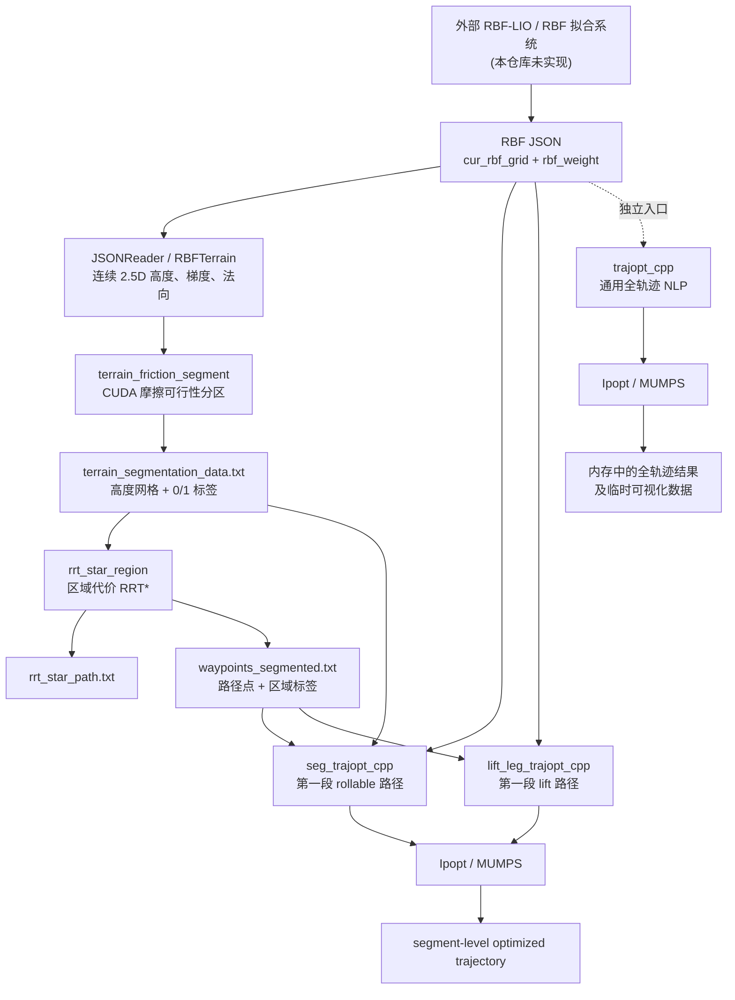

# 1. System Overview

本仓库是一个面向双轮/轮腿机构的离线地形规划与轨迹优化研究工程。上游以 RBF（Radial Basis Function）提供连续的局部 2.5D 高度场，本仓库消费已经导出的 RBF 参数，依次完成：

```text
RBF terrain reconstruction
-> friction-aware terrain segmentation
-> region-aware RRT* coarse planning
-> trajectory segmentation
-> rollable-region trajectory optimization
-> lift-leg trajectory optimization
```

根目录的 `RBF_LIO.pdf` 解释了 RBF-LIO 中地形表示的理论背景；代码侧的基本地形模型是

```text
z = f(x, y) = sum_i w_i exp(-||[x, y] - c_i||^2 / (2 sigma^2))
```

其中地形梯度用于构造向上的法向 `[-df/dx, -df/dy, 1]`。本仓库**不是 RBF-LIO SLAM/LIO 本身**：源码中没有 LiDAR/IMU 驱动、点云前端、IMU 预积分、状态传播、地图在线更新或 ROS 节点。RBF JSON 是外部生成的静态输入；其上游传感器数据流和状态估计实现均为 **UNKNOWN（不在本仓库中）**。因此，本工程应被理解为 RBF 地形表示的下游 planning / optimization 系统。

工程同时保留两条实现路线：

- 根目录的 Python/CasADi 代码用于算法原型和接口实验；
- C++/Ipopt 代码是较完整的主实现，其中 CUDA 仅用于地形摩擦分区。

# 2. High-Level Architecture



图中的“trajectory segmentation”由 `rrt_star_region` 输出端的路径点标注和两个 `WaypointReader` 的连续区段提取共同完成，并非一个独立可执行程序。当前 `seg_trajopt_cpp` 与 `lift_leg_trajopt_cpp` 分别读取第一段匹配标签的路径。

`trajopt_cpp` 是独立的通用全轨迹 NLP：它直接从 RBF JSON 和代码中的起终状态构造问题，同时显式优化接触力。它不是 segment pipeline 中 `seg_trajopt_cpp` 或 `lift_leg_trajopt_cpp` 的完全等价替代步骤。

# 3. Repository Structure

| 路径 | 职责 | 与其他部分的关系 |
|---|---|---|
| `core/` | Python 变量块、变量打包/缩放和目标项抽象。 | 为模块化 Python 原型提供基础设施，目前没有完整组装为可运行 NLP。 |
| `constraints/` | Python 版离地间隙、轮距、防交叉等约束函数。 | 可供 `solver/` 定义的问题调用，但当前根目录没有一个端到端装配器。 |
| `geometry/` | Python 地形对象与高度/梯度计算。 | 属于 Python 原型；不与 C++ `RBFTerrain` 共享实现或二进制接口。 |
| `solver/` | `NLPProblem`/`Solver` 协议及 CasADi-Ipopt 包装。 | 把 NumPy 风格回调包装为 CasADi callback；当前缺少连接全部模块的具体问题类。 |
| `terrain_friction_segment/` | RBF JSON 读取、CUDA 高度场法向/摩擦分区、CPU 侧结果落盘，以及区域代价 RRT*。 | 产生 segment pipeline 的 `terrain_segmentation_data.txt`、粗路径和带标签 waypoint。 |
| `trajopt_cpp/` | 通用 C++ 全轨迹 NLP、公共基函数/RBF/JSON 基础代码、约束与目标、可视化桥接。 | 自身可独立运行；部分源码被 `seg_trajopt_cpp` 和 `lift_leg_trajopt_cpp` 直接编入各自目标。 |
| `seg_trajopt_cpp/` | 可滚动区域的 segment-level 轨迹优化。左右轮 `z` 由 RBF 地形隐式确定。 | 读取标签 `1` 的第一段 waypoint，并读取分区网格构造区域约束。 |
| `lift_leg_trajopt_cpp/` | 需抬腿区域的 segment-level 轨迹优化。左右轮 `z` 使用分段 Chebyshev 系数。 | 优先读取标签 `0` 的第一段 waypoint；没有接入统一的全路径拼接器。 |
| `test/` | CasADi 可用性检查、CuPy 性能实验，以及当前工作区中的地形/路径测试夹具。 | 不是统一自动化测试套件；地形夹具也充当 C++ 数据链示例输入。 |
| 根目录 Python 脚本 | `main.py`、`solve_casadi.py`、`trajopt_sdf.py` 是不同成熟度的原型/演示入口。 | 不负责调用 CUDA 分区、C++ RRT* 和 C++ segment 优化器。 |
| `utils/` | Python JSON 读取和绘图等辅助函数。 | 与其他 Python 文件中已有逻辑存在部分重叠。 |

仓库还包含历史构建目录、日志、图片和实验输出。这些文件不是架构定义；理解当前系统时应以源码和当前 `CMakeLists.txt` 为准。

# 4. Python Prototype Architecture

## `main.py`

`main.py` 只演示 `VarBlock`/`Variables` 的建立、边界、缩放和向量打包解包。它不读取地形、不建立完整约束集，也不调用求解器，因此不是工程的运行总入口。

## `solve_casadi.py`

这是一个独立 CasADi `Opti` 原型。它在单文件内读取 RBF、建立 Chebyshev 轨迹系数、目标和几何/地形相关约束，并调用 Ipopt。输入路径和部分问题参数写在脚本入口中。它验证了“多项式轨迹 + RBF 地形 + CasADi/Ipopt”的思路，但没有串接 CUDA 分区和区域 RRT*。

## `trajopt_sdf.py`

这是另一个更集中式的 CasADi 原型，显式包含基座/双轮三维轨迹和离散接触力变量，并把平衡、摩擦、接触等条件写入目标或约束。它与 C++ `trajopt_cpp` 在问题形态上更接近，但仍是独立脚本，不是 C++ 实现的 Python binding。

## 模块化 Python 层

- `core/variable.py`：`VarBlock` 和 `Variables`，管理变量块、上下界、尺度及 solver vector 的 pack/unpack；
- `core/objective.py`：目标项协议、加权组合，以及终点、加速度平滑、侧滑、轮距、基座间隙等目标；
- `constraints/clearance.py`：轮/地间隙约束；
- `constraints/track_width.py`：轮距和防交叉约束；
- `geometry/terrain.py`：Python 侧 RBF 地形演示实现；
- `solver/base.py`：问题和求解器协议、求解结果数据结构；
- `solver/casadi_ipopt.py`：将 NumPy 风格的目标、梯度、约束和 Jacobian 回调包装给 CasADi/Ipopt。

这些模块已经形成变量、目标、约束和 solver adapter 的分层，但源码中尚未提供一个把它们完整组装成具体 `NLPProblem`、加载当前数据链并运行的端到端入口。因此它们属于 prototype infrastructure，而非当前 C++ pipeline 的调度层。

# 5. C++ Main Architecture

## 三个优化器的定位

| 子工程 | 优化范围 | 地形/路径输入 | 核心差异 |
|---|---|---|---|
| `trajopt_cpp` | 代码定义的完整起终区间 | RBF JSON；起终状态主要在 `main.cpp` 中设置 | 同时优化 10 组轨迹系数和 6 组离散接触力；目标和约束最完整。 |
| `seg_trajopt_cpp` | 第一段标签 `1` 的连续路径 | RBF JSON、分区网格、带标签 waypoint | 8 组轨迹系数；双轮高度由地形隐式给出；面向滚动段。 |
| `lift_leg_trajopt_cpp` | 第一段标签 `0` 的连续路径，找不到时回退到标签 `1` | RBF JSON、带标签 waypoint | 基座及轮平面轨迹使用全局系数，轮高使用分段系数；面向交替摆动/接触。 |

## 公共代码复用方式

`trajopt_cpp` 没有导出一个供其他目标链接的公共库。根据两个 segment 子工程的 `CMakeLists.txt`，它们通过相对路径定位同级 `../trajopt_cpp`，加入其头文件目录，并把以下 `.cpp` 源文件直接编译进各自可执行文件：

- `chebyshev_basis.cpp`；
- `polynomial_basis.cpp`；
- `polynomial.cpp`；
- `rbf_terrain.cpp`；
- `json_reader.cpp`；
- `objectives/yaw_path_alignment_objective.cpp`。

因此共享的是源码实现而不是动态/静态库 ABI。公共文件中的修改会同时影响三个目标，但仍可能因每个目标的编译选项、宏或周边类不同而表现不同。其余 segment 约束、目标和 `SegTrajOptNLP` 均由各子工程自己的源码实现。

## 公共抽象

- `BasisFunction`/`ChebyshevBasis`：在参数 `s in [0,1]` 上计算基函数及一、二阶导数，内部映射到 Chebyshev 区间；
- `Polynomial`/`PolynomialBasis`：为共享目标提供统一基函数访问；
- `RBFTerrain`：高度、解析梯度、法向和中心包围盒；
- `JSONReader`：读取 RBF JSON 并构造 `RBFTerrain`；
- `ConstraintBase`：约束维度、值、边界、稀疏 Jacobian 结构和值；
- `ObjectiveBase`：目标值和梯度累加接口；
- `TrajOptNLP`/`SegTrajOptNLP`：聚合目标和约束，实现 Ipopt `TNLP` 生命周期。

# 6. Terrain Processing Architecture

地形处理链为：

```text
RBF JSON
  -> JSONReader
  -> centers / weights + hard-coded sigma
  -> CUDA grid evaluation
  -> gradient and upward normal
  -> friction feasibility
  -> binary label grid
```

主要文件及职责：

- `terrain_friction_segment/src/main.cpp`：解析 RBF 路径、输出目录和摩擦系数，确定地形网格范围，调用 CUDA 包装，随后在 CPU 侧生成高度和可视化/文本输出；
- `terrain_friction_segment/src/json_reader.cpp`：读取 `cur_rbf_grid` 与 `rbf_weight`；
- `terrain_friction_segment/src/rbf_friction_cuda.cpp`：主机端内存分配、H2D/D2H 复制和 kernel 启动接口；
- `terrain_friction_segment/cuda/rbf_friction_kernel.cu`：每个网格点累加全部 RBF 中心的梯度，归一化法向并进行摩擦可行性判定；
- `terrain_friction_segment/external/stb_image_write.h`：写出 PNG 的第三方单头文件依赖。

当前分类规则把地形法向的竖直分量与 `1 / sqrt(1 + mu^2)` 比较，等价于用坡度和摩擦系数判断是否可滚动。固定标签契约为：

- `0 = lift`：该网格被视为需要抬腿；
- `1 = rollable`：该网格被视为可滚动。

标签表示运动模式代价/选择，不是独立障碍物占据栅格。当前 CUDA kernel 对每个网格点遍历全部 RBF 中心；CPU 侧又单独重建高度供文件和图片输出。

# 7. Coarse Planning Architecture

`terrain_friction_segment` 子工程中的第二个可执行目标 `rrt_star_region` 承担粗路径规划。

## 输入

- `terrain_segmentation_data.txt` 的网格尺寸、边界和标签；高度行会被读入/跳过，但当前 RRT* 代价由二维路径长度和区域标签决定；
- 命令行给出的二维起点、终点和路径文本输出位置；
- 源码中的采样次数、步长、到达半径、重连半径、边采样数和区域惩罚等参数。

## 树与区域代价

`RRTStarRegion` 以并行数组保存节点的 `x`、`y`、`parent` 和累计 `cost`，并用二维 bucket 索引加速邻域查询。采样、steer、近邻父节点选择和 rewire 均在地形二维边界内进行。

一条边被离散采样；每个小段的欧氏长度乘以所在区域权重。当前可滚动区权重为 `1`，lift 区权重为 `k_lift`（默认 `5`）。两类区域都可通过，因此这是 region-aware cost，而不是把 lift 区当作硬障碍。

## 输出与 waypoint 分段

- `rrt_star_path.txt` 保存回溯后的二维路径；
- `waypoints_segmented.txt` 为每个路径点附上最近网格的 `0/1` 标签；
- PNG 用于显示分区、树和最终路径。

后续 `WaypointReader` 扫描标签变化，把路径理解为连续段；当前两个细化器并不会遍历返回全部区段，而是提取第一段请求标签的连续 waypoint。

# 8. Fine Trajectory Optimization Architecture

三个 C++ 优化器都使用归一化路径参数 `s`、Chebyshev 系数和 Ipopt `TNLP`。`get_nlp_info` 声明变量/约束/Jacobian 规模，`get_bounds_info` 提供边界，`get_starting_point` 提供初值，`eval_f`/`eval_grad_f` 聚合目标，`eval_g`/`eval_jac_g` 聚合约束，`finalize_solution` 保存求解器返回的最终迭代。Hessian 不显式提供，入口配置 Ipopt 使用 limited-memory 近似。

## `trajopt_cpp`: 通用全轨迹 NLP

**决策变量。** 当前常量为 `N_COEFF = 5`、`N_SAMPLE = 25`。前 `10 * N_COEFF` 个变量是

```text
cbx cby cbz cpsi clx cly clz crx cry crz
```

随后是 6 组、每组 `N_SAMPLE` 个离散接触力：

```text
fLx fLy fLz fRx fRy fRz
```

当前总变量数为 200。基座和左右轮三维轨迹均由 Chebyshev 系数表示，接触力不使用多项式参数化。

**目标。** 入口组合了轨迹平滑、正则化、轮-基座名义距离、左右轮名义距离、轮-地距离、离地惩罚、路径长度、前进进度、航向对齐、接触刚度、力平衡、力矩平衡和摩擦锥等目标。力/力矩平衡和摩擦锥在该实现中是软目标，不应描述为全部都是等式/不等式硬约束。

**约束。** 包括起终边界、轨迹坐标范围、轮-基座距离、左右轮距离、防交叉、轮离地关系和法向力上界。

**初值与提取。** `main.cpp` 使用代码内的起终状态生成 Chebyshev-Lobatto 采样点，通过拟合得到轨迹系数，并把竖直接触力初始化为重力的左右分配。求解后从系数与离散力块重建采样轨迹和接触力。

**输出。** 当前实现打印系数并通过 `/tmp` 文本桥接调用 Python 可视化；没有像两个 segment 优化器一样在用户指定目录稳定写出 `initial_trajectory.txt` 和 `final_trajectory.txt`。接触力文件是按进程号命名的临时文件，可视化调用后会删除。

## `seg_trajopt_cpp`: 可滚动段优化

**决策变量。** 当前 `N_COEFF = 5`、`N_SAMPLE = 15`，共有 8 组系数：

```text
cbx cby cbz cpsi clx cly crx cry
```

左右轮的 `z` 不作为变量，而是在每个采样点由 `RBFTerrain::height(x,y)` 计算。

**目标。** 初值邻近、基座高度稳定和航向-路径对齐。

**约束。** 起终边界、轨迹范围、系数范数、分区插值约束、三维轮-基座距离以及左右轮距离。分区约束读取 `terrain_segmentation_data.txt`，对轮的平面位置做双线性插值。

**初值与输出。** `WaypointReader` 读取第一段标签 `1` 的路径，主程序将 waypoint 拟合为 Chebyshev 系数。输出目录中写 `initial_trajectory.txt`、`final_trajectory.txt` 和用于绘图的 `terrain_grid.txt`。

## `lift_leg_trajopt_cpp`: 抬腿段优化

**决策变量。** 当前 `N_COEFF = 8`、`N_SAMPLE = 21`。基座 `x/y/z/yaw` 与左右轮 `x/y` 使用 8 组全局系数；左右轮 `z` 分别对每个高度段使用一组 Chebyshev 系数。若高度段数为 `N_SEG_Z`，变量数为：

```text
8 * N_COEFF + 2 * N_COEFF * N_SEG_Z
```

**接触建模。** 本优化器没有显式接触力决策变量。入口依据路径进度构造左右轮交替的接触掩码，在候选接触点附近搜索较小坡度位置；穿透相关约束用地形高度与轮高差的平滑正部函数近似法向力。

**目标。** 初值邻近、基座高度稳定、航向-路径对齐和摆动轮抬升。

**约束。** 起终边界、轨迹范围、系数范数、轮-基座距离、左右轮距离、最大地形穿透、基于穿透的力条件，以及多高度段时的分段 `z` 连续性。

**初值与输出。** 优先读取第一段标签 `0` 的 waypoint；若不存在则回退到第一段标签 `1`。路径被加密，接触/摆动轮高轮廓被构造后再拟合为全局或分段系数。输出 `initial_trajectory.txt` 和 `final_trajectory.txt`；绘图脚本消费这些文件和可选 RBF JSON。

# 9. Data Contracts

下表只记录能够从当前生产者/消费者源码确定的字段。文本均为空白分隔；源码没有声明版本号、schema ID 或兼容性协商。

| 数据 | 当前格式 | 生产者 / 消费者 |
|---|---|---|
| RBF JSON | 必需键 `cur_rbf_grid`：`N x 2` 的 `[x,y]` 中心；`rbf_weight`：长度 `N` 的权重数组。两者索引一一对应。其他可能存在的键不被当前 C++ reader 使用，其语义为 **UNKNOWN**。 | 外部系统生产；三个 C++ 优化器和地形分区读取。 |
| `segmentation.txt` | 第 1 行：`nx ny xmin xmax ymin ymax`；第 2 行：`nx*ny` 个整数标签，按网格行优先顺序写出。 | CUDA 分区程序生产；主要供检查/可视化。 |
| `terrain_segmentation_data.txt` | 第 1 行同上；第 2 行：`nx*ny` 个 RBF 高度；第 3 行：`nx*ny` 个 `0/1` 标签。 | 分区程序生产；RRT* 和 `seg_trajopt_cpp` 消费。 |
| `rrt_star_path.txt` | 每行 `x y`，从起点到终点排列。无表头。 | `rrt_star_region` 生产；绘图脚本可消费。 |
| `waypoints_segmented.txt` | 每行 `x y label`，其中 `label` 是该点最近网格标签。无显式 segment ID。连续相同标签由 reader 解释为一段。 | `rrt_star_region` 生产；seg/lift 的 `WaypointReader` 消费。 |
| `initial_trajectory.txt` / `final_trajectory.txt` | 表头 `s xb yb zb psi xl yl zl xr yr zr`；后续每行一个采样点。 | 两个 segment 优化器生产；各自绘图脚本消费。通用 `trajopt_cpp` 当前不稳定生成这两个文件。 |
| segment `terrain_grid.txt` | 第 1 行 `nx ny xmin xmax ymin ymax`；之后按网格顺序每行一个高度。 | `seg_trajopt_cpp` 的轨迹保存逻辑生产；绘图脚本消费。是否由所有 lift 运行生成取决于具体调用路径，不应视为 lift 的稳定必需输出。 |
| 通用轨迹可视化临时文件 | `/tmp/trajectory_data.txt`：首行采样数，随后每行 `xb yb zb psi xl yl zl xr yr zr airborne_l airborne_r`。配套 `/tmp/rbf_terrain_data.txt`：网格大小、边界、x 向量、y 向量及高度矩阵。 | `trajopt_cpp` C++ 可视化类生产；Python 可视化脚本消费。路径为硬编码临时接口。 |
| 通用接触力临时文件 | 首行为 `N_SAMPLE`；随后依次为 6 行力分量 `fLx fLy fLz fRx fRy fRz`、9 行轨迹坐标、6 行左右地形法向，最后 3 行为质量、重力、摩擦系数。每一向量行有 `N_SAMPLE` 个值。 | `ForceDataSaver` 生产、`visualize_forces.py` 消费；调用后删除，不是持久实验结果。 |
| PNG/绘图输入 | 分区/RRT PNG 由 C++ 直接生成；segment 绘图读取轨迹文本，lift 绘图还可读取 RBF JSON；地形分区 Python 脚本读取 `terrain_segmentation_data.txt`。 | 可视化用途，不参与求解器数据回传。 |

当前 C++ `JSONReader` 把 `sigma` 固定为 `0.14`，JSON 本身没有被当前 reader 用作带宽配置。RBF JSON 的坐标系名称、数据生产时间语义以及其他元数据字段，从本仓库代码无法确认，均为 **UNKNOWN**。

# 10. Execution Flow

```mermaid
sequenceDiagram
    participant U as Researcher / script
    participant S as terrain_friction_segment
    participant C as CUDA kernel
    participant R as rrt_star_region
    participant W as WaypointReader
    participant O as seg or lift TrajOptNLP
    participant I as Ipopt
    participant V as output / visualization

    U->>S: RBF JSON, output directory, mu
    S->>S: parse centers and weights; define grid
    S->>C: centers, weights, sigma, bounds, mu
    C-->>S: binary rollable/lift labels
    S->>S: CPU reconstruction of grid heights
    S-->>U: terrain_segmentation_data.txt and images

    U->>R: segmentation data, start, goal
    R->>R: sample tree with region-weighted edge cost
    R-->>U: rrt_star_path.txt
    R-->>U: waypoints_segmented.txt

    U->>W: waypoints_segmented.txt, requested label
    W-->>O: first contiguous matching segment
    O->>O: build Chebyshev initial guess, objectives, constraints
    O->>I: TNLP callbacks
    loop Ipopt iterations
        I->>O: objective, gradient, constraints, Jacobian
        O-->>I: evaluated values
    end
    I-->>O: final iterate and solver status
    O-->>V: initial/final segment trajectory
```

当前完整执行链需要用户或外部脚本按顺序调用多个可执行文件。源码中未发现统一 orchestrator；`seg_trajopt_cpp` 和 `lift_leg_trajopt_cpp` 不会自动遍历所有交替 segment；也未发现把各 segment 解按边界连续性拼接成整条路线的实现。因此，“从 RBF 到最终完整轨迹”是架构目标和人工可组合的数据链，而不是当前单次命令已经封装好的事务。

此外，`finalize_solution` 保存的是 Ipopt 提供的最终迭代。调用方在解释输出时仍应检查求解器状态；文件存在本身不能证明已收敛到可接受解。

# 11. Dependency Architecture

| 依赖 | 使用模块 | 作用 |
|---|---|---|
| C++17 | 全部 C++ 子工程 | 核心语言标准。 |
| CMake | 四个 C++ 子工程 | 每个子工程独立配置和构建，没有根目录统一 superbuild。 |
| Ipopt | `trajopt_cpp`、`seg_trajopt_cpp`、`lift_leg_trajopt_cpp` | NLP 求解器与 `TNLP` API。 |
| MUMPS | 上述三个优化器 | 当前入口通过 Ipopt 的 `linear_solver=mumps` 选择线性求解器；可用性取决于 Ipopt 构建。 |
| CUDA Toolkit / CUDA runtime | `terrain_friction_segment` 的分区可执行目标 | GPU 计算 RBF 梯度、法向和二值标签。`rrt_star_region` 本身是 CPU C++。 |
| Python 3 | 根目录原型、所有绘图/可视化脚本、测试脚本 | 原型求解和结果展示。 |
| NumPy | Python 原型与绘图 | 数值数组、轨迹/地形处理。 |
| Matplotlib | Python 绘图脚本和原型可视化 | 地形、轨迹、运动学和接触力绘图。 |
| CasADi | `solve_casadi.py`、`trajopt_sdf.py`、`solver/casadi_ipopt.py`、CasADi smoke test | Python NLP 建模及 Ipopt 接口。 |
| CuPy | `test/cupy_test.py` | GPU 数值性能实验；不参与 C++ 主数据链。 |

`terrain_friction_segment` 还内置 `stb_image_write.h` 用于 PNG 输出。工程没有统一依赖锁文件，也没有根目录级 CMake 配置。

# 12. Extension Points

- **Terrain model**：以 `RBFTerrain`/`JSONReader` 为边界增加可配置核宽、其他核函数或其他连续高度模型；扩展时必须同步 CUDA 与 CPU 的公式和数据契约。
- **Friction classification**：替换或扩展 kernel 中单一坡度阈值，加入空间变化摩擦系数、置信度或不可通行标签。
- **Coarse planner**：通过 `RRTStarRegion` 的 edge cost、采样、邻域索引和 path export 接口扩展代价或替换规划器。
- **Trajectory basis**：通过 `BasisFunction`/`Polynomial` 抽象增加其他基函数；变量顺序和导数接口必须同步所有消费者。
- **Objectives**：实现 `ObjectiveBase` 并在相应 `main.cpp` 注册；梯度应累加到全局梯度。
- **Constraints**：实现 `ConstraintBase`，保持约束值、上下界、Jacobian 稀疏结构和值的维度/顺序一致。
- **Whole-path segment orchestration**：新增读取全部标签段、选择 roll/lift 求解器、管理失败重试和输出命名的调度层。
- **Segment stitching**：在相邻段之间增加位置、姿态、速度/加速度及接触模式连续性契约，然后形成全路线结果。
- **Configuration**：把路径、RBF `sigma`、机构参数、求解器选项和代价权重从入口常量集中到版本化配置。
- **Real robot interface**：可在稳定轨迹 schema 之外新增时间参数化、控制命令和状态反馈适配层。当前仓库没有 ROS/实时控制接口，其具体消息、频率和安全状态机均为 **UNKNOWN**。

# 13. Known Architectural Limitations

以下限制均能从当前源码或构建配置确认：

1. Python prototype 与 C++ mainline 并存，但没有共享模型库、统一配置或统一运行入口。
2. Python 模块化层具备变量/目标/约束/solver 抽象，却缺少组装当前完整问题的具体 `NLPProblem`。
3. 三个 C++ 优化器通过直接重复编译公共 `.cpp` 复用代码，而非链接公共库；Python 与 C++ 之间也存在 RBF/目标逻辑的平行实现。
4. 多个入口和可视化类包含 `/home/yizhe/...`、`/tmp/...` 等硬编码路径。RRT* 命令行只能覆盖路径文本位置，带标签 waypoint 和 PNG 仍使用源码内默认输出目录。
5. C++ `JSONReader` 当前固定 `sigma = 0.14`；`RBF_LIO.pdf` 给出的论文实验带宽为 `0.04 m`。两者处于不同配置来源，源码没有自动协调机制。
6. segment pipeline 只优化第一段匹配类型的连续 waypoint；没有自动遍历全部段、统一调度或 segment stitching。
7. `trajopt_cpp` 是独立全轨迹问题，不能直接视为 roll/lift segment pipeline 的汇总阶段。
8. CUDA 分区与 CPU 输出分别计算地形量，当前没有共享同一次高度计算结果。
9. `seg_trajopt_cpp` 的当前区域约束默认参数为 `threshold=0.1`、`buffer=0.1`，约束形式允许插值标签达到 `0`；在标签范围 `[0,1]` 下，这一默认设置不会排除 lift 网格。
10. `lift_leg_trajopt_cpp` 的高度段数量按起终高度的正向净差和固定步长确定；源码中没有基于完整地形高度聚类的段构造器。
11. `RRTStarRegion` rewire 会更新被重连节点的父节点和代价，但当前函数没有递归传播其后代节点的累计代价变化。
12. 通用 `trajopt_cpp` 的轨迹/接触力主要通过硬编码临时文件进入可视化；没有与 segment 输出一致的持久结果 schema。
13. 当前仓库没有 ROS 节点、launch/参数文件、LiDAR/IMU 数据通路、RBF-LIO 状态估计或真实机器人执行接口。

## Code Reading Order

建议新开发者按数据链而不是按目录字母顺序阅读：

1. 根目录 `AGENTS.md`：先了解数据标签、不变量、构建边界和禁止修改项；
2. `terrain_friction_segment/src/main.cpp`、`src/json_reader.cpp`：理解 RBF 输入和分区输出；
3. `terrain_friction_segment/src/rbf_friction_cuda.cpp`、`cuda/rbf_friction_kernel.cu`：理解 CPU/CUDA 边界与摩擦标签；
4. `terrain_friction_segment/src/rrt_star_main.cpp`、`include/rrt_star_region.hpp`、`src/rrt_star_region.cpp`：理解粗路径、区域代价和 waypoint 标注；
5. `trajopt_cpp/include/rbf_terrain.hpp`、`src/rbf_terrain.cpp`、`include/chebyshev_basis.hpp`、`src/chebyshev_basis.cpp`：掌握三个优化器共享的地形与轨迹表示；
6. `seg_trajopt_cpp/main.cpp`、`src/waypoint_reader.cpp`、`src/segmentation_reader.cpp`：跟踪可滚动段的数据入口和初值；
7. `seg_trajopt_cpp/src/seg_trajopt_nlp.cpp`，随后阅读其 `constraints/` 和 `objectives/`：理解较小的 TNLP 聚合模型；
8. `lift_leg_trajopt_cpp/main.cpp`、`src/waypoint_reader.cpp`、`src/seg_trajopt_nlp.cpp`：对比抬腿模式、分段轮高和接触掩码；
9. `trajopt_cpp/main.cpp`、`include/trajopt_nlp.hpp`、`src/trajopt_nlp.cpp`：最后阅读变量最多的通用全轨迹 NLP，再按注册顺序进入各目标和约束；
10. `core/`、`constraints/`、`geometry/`、`solver/`，然后 `solve_casadi.py` 与 `trajopt_sdf.py`：用于比较 Python 原型与 C++ 主线，而不是寻找统一调度入口；
11. 各子工程 `scripts/` 和 `test/`：确认输出如何被可视化，以及现有 smoke/performance 实验覆盖了什么。
